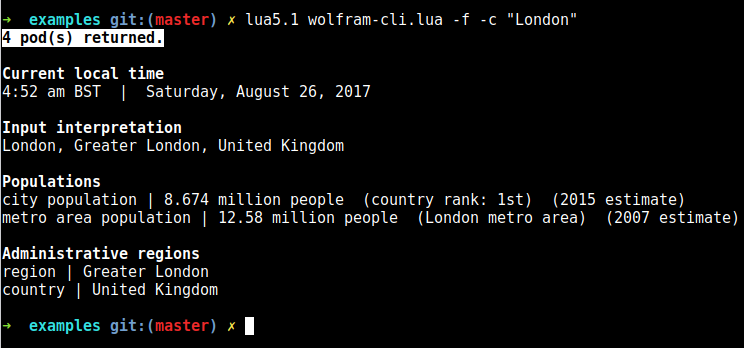

# Example

A terminal client for Wolfram|Alpha written in Lua, with nice pretty-printing.

## How to run

Firstly, replace `YOUR-API-KEY-HERE` in the code by your API key, that can be obtained [here](https://products.wolframalpha.com/api/).

Running `lua wolfram-cli.lua --help` prints the following:

```
ARGUMENTS:
  query       Query to Wolfram|Alpha server. (required)

OPTIONS:
  -c, --count Whether to print the count of results returned (for full
              results only).
  -f, --full  Whether to return full results.
```

## Screenshot

*Example of full query, with count of results.*

## Additional dependencies

Apart from package's dependencies, these are additional dependancies for running this package:
* [cliargs](https://luarocks.org/modules/amireh/lua_cliargs)
* [lua-term](https://luarocks.org/modules/hoelzro/lua-term)